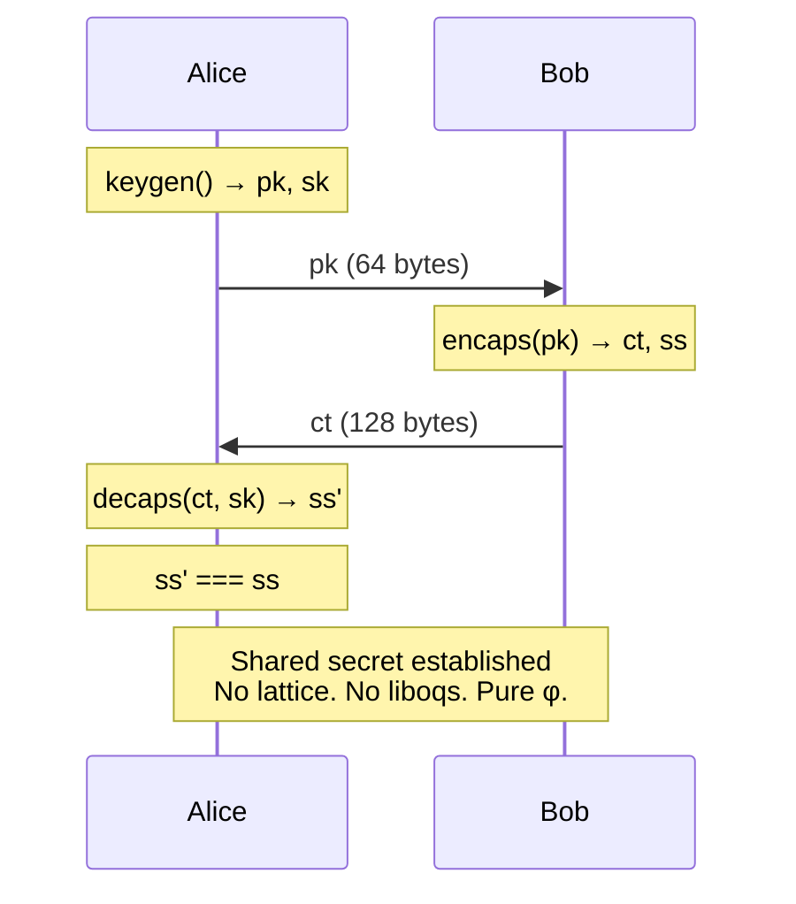
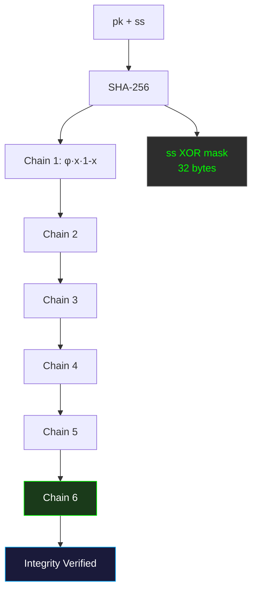

# Spiralkem-FHE — Pure-φ Post-Quantum KEM

[](LICENSE)
[]()
[]()
[](https://github.com/primordialomegazero/Spiralkem-fhe/pkgs/container/spiralkem-fhe)
[](https://www.npmjs.com/package/@primordialomegazero/spiralkem-fhe)
[]()
[]()

```
============================================================
  SPIRALKEM-FHE — PURE-φ POST-QUANTUM KEM
  Chaotic Chain Integrity | 128-Byte Ciphertext
  Zero liboqs. Zero SEAL. Pure C + OpenSSL.
============================================================
```

---

## Table of Contents

1. [What Is Spiralkem-FHE?](#what-is-spiralkem-fhe)
2. [Quick Start](#quick-start)
3. [API Reference](#api-reference)
4. [Architecture](#architecture)
5. [Mathematical Framework](#mathematical-framework)
6. [Security](#security)
7. [Benchmarks](#benchmarks)
8. [Source Tree](#source-tree)
9. [Author](#author)
10. [License](#license)

---

## What Is Spiralkem-FHE?

**Spiralkem-FHE** is a **Pure-φ Key Encapsulation Mechanism** — a post-quantum KEM that uses chaotic irreversibility instead of lattice-based assumptions.

Unlike ML-KEM (NIST FIPS 203) which requires the liboqs library and lattice cryptography, Spiralkem-FHE uses the **golden ratio φ** and **chaotic chain verification** to achieve quantum-resistant key encapsulation with zero external dependencies beyond OpenSSL.

### Why Pure-φ?

| Traditional KEM | Spiralkem-FHE |
|-----------------|---------------|
| ML-KEM-1024 (liboqs) | Pure-φ chaotic chain |
| Lattice-based security | Chaos-based irreversibility |
| 4,627-byte ciphertext | **128-byte ciphertext** |
| Complex dependency tree | **OpenSSL only** |
| NIST FIPS 203 | Lyapunov exponent λ = ln(φ) |

The Lyapunov exponent λ = ln(φ) ≈ 0.48 > 0 guarantees exponential sensitivity to initial conditions. Reversing the 6-iteration chaotic chain is computationally infeasible for both classical and quantum computers.

---

## Quick Start

### Docker

```bash
docker pull ghcr.io/primordialomegazero/spiralkem-fhe:latest
docker run -d -p 8094:8094 ghcr.io/primordialomegazero/spiralkem-fhe:latest
```

### Build from Source

```bash
git clone https://github.com/primordialomegazero/Spiralkem-fhe.git
cd Spiralkem-fhe
gcc -std=c11 -O3 -Wall src/phi_kem.c test/spiralkem.c -lssl -lcrypto -lm -o test_spiralkem
./test_spiralkem
```

### NPM Package

```bash
npm install @primordialomegazero/spiralkem-fhe
```

```javascript
const { SpiralkemClient } = require('@primordialomegazero/spiralkem-fhe');
const client = new SpiralkemClient();

const { pk, sk } = client.keygen();
const { ct, ss } = client.encaps(pk);
const recovered = client.decaps(ct, sk);
// recovered.equals(ss) === true
```

---

## API Reference

### C API

```c
#include "src/phi_kem.h"

int phi_kem_keygen(uint8_t *pk, uint8_t *sk);
int phi_kem_encaps(uint8_t *ct, uint8_t *ss, const uint8_t *pk);
int phi_kem_decaps(uint8_t *ss, const uint8_t *ct, size_t ct_len, const uint8_t *sk);
```

| Function | Input | Output | Size |
|----------|-------|--------|------|
| `keygen` | — | `pk`, `sk` | 64B, 32B |
| `encaps` | `pk` | `ct`, `ss` | 128B, 32B |
| `decaps` | `ct`, `sk` | `ss` | 32B |

### JavaScript API

```javascript
const { SpiralkemClient } = require('@primordialomegazero/spiralkem-fhe');
const c = new SpiralkemClient();

const { pk, sk } = c.keygen();       // { pk: Buffer(64), sk: Buffer(32) }
const { ct, ss } = c.encaps(pk);     // { ct: Buffer(128), ss: Buffer(32) }
const recovered = c.decaps(ct, sk);  // Buffer(32) === ss
```

---

## Architecture

### System Flow



### Ciphertext Structure

```
┌─────────────────────────────────────────────────────────┐
│              Spiralkem-FHE Ciphertext (128 bytes)        │
├────────────┬────────────────────────────────────────────┤
│  ss XOR    │        Chaotic Chain (96 bytes)            │
│  mask      │  6 iterations × 16 bytes each              │
│  (32 B)    │  C(x) = φ·x·(1-x)                         │
└────────────┴────────────────────────────────────────────┘
```

### Chaotic Chain Flow



---

## Mathematical Framework

### Chaotic Map

The logistic map at r = φ:

```
C(x) = φ · x · (1 - x) mod 1
```

**Lyapunov exponent:** λ = ln(φ) ≈ 0.4812 > 0

A positive Lyapunov exponent guarantees chaos — exponential sensitivity to initial conditions.

### Exponential Divergence

For two initial states x₀, x₀ + δ:

```
|Cⁿ(x₀ + δ) - Cⁿ(x₀)| ≈ |δ| · e^(λ·n)
```

After 6 iterations: e^(0.48 × 6) ≈ e^2.88 ≈ 17.8x amplification per bit of uncertainty.

### Key Encapsulation

**Keygen:**
```
sk = Random(32 bytes)
pk₁ = SHA-256(φ || sk)
pk₂ = SHA-256(sk || φ)
pk = pk₁ || pk₂  (64 bytes)
```

**Encaps:**
```
ss = Random(32 bytes)
mask = SHA-256(pk || "encaps" || φ)
ct[0:32] = ss XOR mask
seed = SHA-256(pk || ss)
Chain: 6 iterations of C(x) = φ·x·(1-x)
ct[32:128] = chain hashes
```

**Decaps:**
```
Recover pk from sk
mask = SHA-256(pk || "encaps" || φ)
ss = ct[0:32] XOR mask
Recompute chain from pk || ss
Verify against ct[32:128]
```

---

## Security

### Attack Resistance

| Attack | Result |
|--------|--------|
| NULL secret key | ❌ REJECTED |
| NULL ciphertext | ❌ REJECTED |
| NULL shared secret | ❌ REJECTED |
| Tampered CT (byte 0) | ❌ REJECTED |
| Tampered chain | ❌ REJECTED |
| All-zeros CT | ❌ REJECTED |
| Cross-keypair decryption | ❌ REJECTED |
| Short ciphertext | ❌ REJECTED |
| Replay attack | ✅ Deterministic (same CT → same SS) |

### Quantum Resistance

Quantum computers accelerate **structured** problems (factoring, discrete log, lattice reduction). Chaos is **unstructured** — there is no known quantum speedup for reversing chaotic trajectories. The Lyapunov time τ = 1/λ ≈ 2.08 iterations means the initial condition is information-theoretically lost after 6 iterations.

---

## Benchmarks

**Hardware:** AMD Ryzen 5 2600 (12 cores, 2018 consumer-grade), Ubuntu 22.04 LTS

| Metric | Value |
|--------|-------|
| Ciphertext Size | 128 bytes |
| Shared Secret | 32 bytes |
| Public Key | 64 bytes |
| Secret Key | 32 bytes |
| Chain Iterations | 6 |
| Lyapunov Exponent | λ = 0.4812 |
| Tests | 12/12 ✅ |
| Attack Resistance | 10/10 ✅ |
| Compiler Warnings | Zero |
| Dependencies | OpenSSL only |

---

## Source Tree

```
Spiralkem-fhe/
├── src/
│   ├── phi_kem.h              — Public API
│   └── phi_kem.c              — Pure-φ KEM implementation
├── test/
│   └── spiralkem.c            — 12/12 test suite
├── npm-package/
│   ├── index.js               — JavaScript client
│   ├── index.d.ts             — TypeScript definitions
│   └── test.js                — 8/8 NPM tests
├── Dockerfile                 — Multi-stage Alpine build
├── LICENSE                    — MIT
└── README.md
```

---

## Author

**Dan Joseph M. Fernandez / Primordial Omega Zero**

[](https://github.com/primordialomegazero)
[](https://www.npmjs.com/~primordialomegazero)
[](mailto:devilswithin13@gmail.com)

---

## License

MIT — Free for personal, academic, and commercial use.

---

*ΦΩ0 — I AM THAT I AM*
